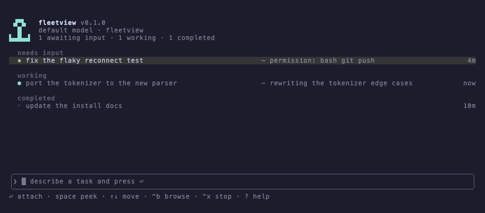
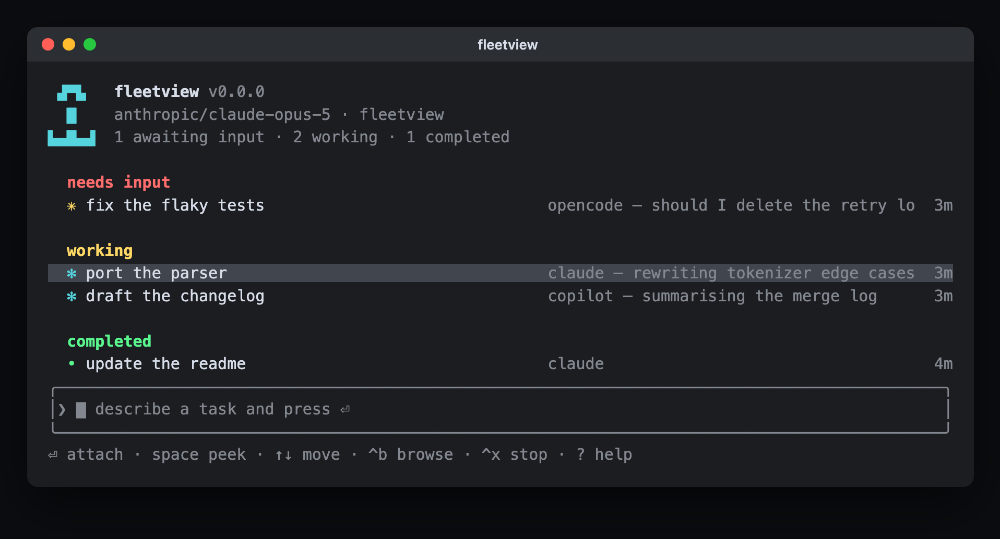
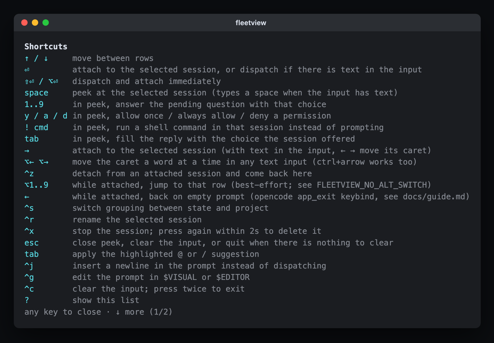
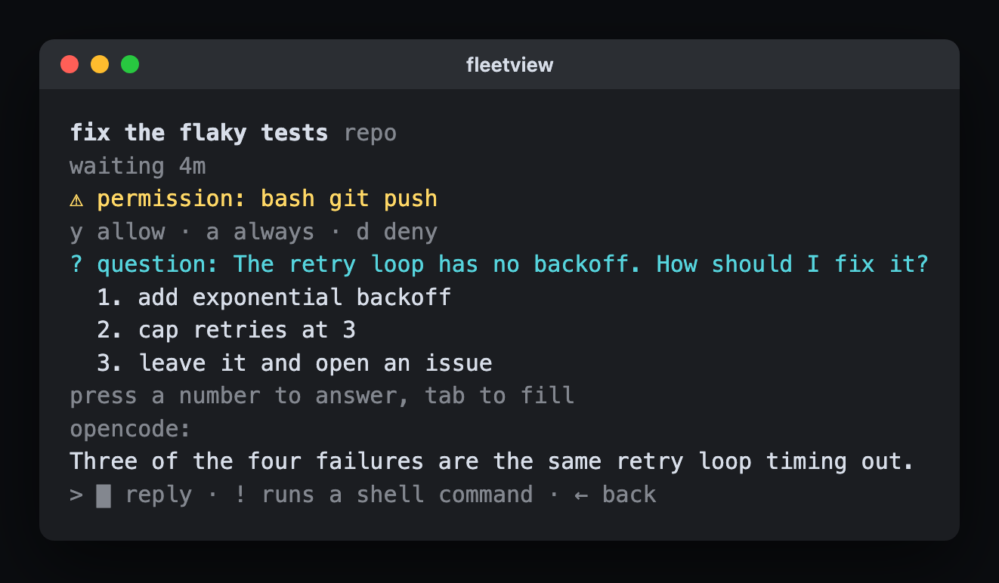
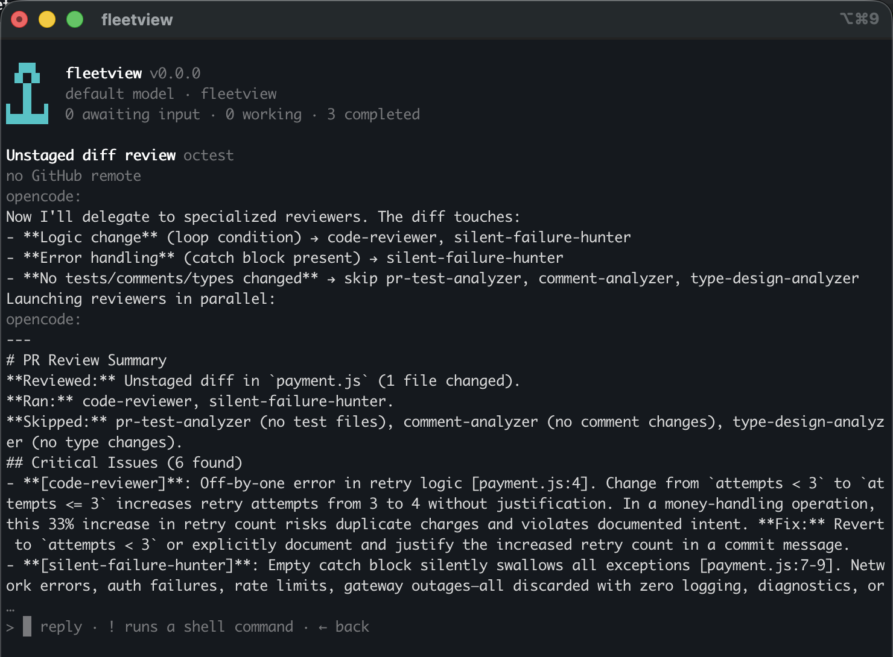

# fleetview

## 30 seconds to your first session

    npm i -g fleetview
    fleetview

Try it without installing first with `npx fleetview` — same thing, nothing left behind.

Type a task and press ⏎: a session starts on it. With the input empty, ⏎ on a row attaches to
that session, and `^z` detaches and leaves it running in the background.



Requirements: Node 24 or newer, macOS or Linux, and at least one of the `opencode`, `claude` or
`copilot` CLIs on `PATH` (each optional, one is enough).

**Claude Code's agent view, for [opencode](https://opencode.ai)** — and, through the same screen,
for Claude Code and GitHub Copilot CLI too. Manage many backgrounded sessions across projects and
backends from one place: dispatch them, watch their status, answer what they ask, attach to any of
them. Close fleetview and the sessions keep running; reopen and pick up where you left off.

It is a deliberate port, not an homage. The groups, the keys, the two-press `^x`, the overloaded
input, the worktree isolation and the `--json` state words are all `claude agents`' behaviour
reproduced against opencode's server, so the rest of this README measures itself against agent
view: that is the specification. Where fleetview can't match it, or chooses not to, it says so.

## Install

The quickstart above is the install. From source instead (for hacking on it):

    git clone https://github.com/costajohnt/fleetview.git
    cd fleetview && npm install && npm link
    fleetview

fleetview is written in TypeScript that Node runs directly by stripping types at load — in a
clone there is no build step to think about (`npm install` emits `dist/` once via `prepare`, and
development runs the `.ts` in `src/`). The npm package ships plain JavaScript in `dist/`, because
Node refuses to strip types for anything under `node_modules`.

No registration step. On first run fleetview spawns one detached `opencode serve`, and every
directory you have ever run opencode in shows up automatically, grouped by project with live
status — including sessions started from opencode's own TUI, not just fleetview's.

Installing builds `node-pty`, which is what lets fleetview keep running behind an attached
session. It ships prebuilt for macOS and Windows; on Linux it compiles and needs `python3`,
`make` and a C++ compiler. Without a usable `node-pty` fleetview still runs — attaching just
hands the terminal over wholesale, costing `^z` detach and `alt+1..9` quick-switch and nothing
else. (A postinstall step restores `spawn-helper`'s executable bit, which the npm tarball drops;
without it attaching fails with `posix_spawnp failed`.)

Two things to know on an unfamiliar machine: `alt+1..9` can misfire over SSH, so set
`FLEETVIEW_NO_ALT_SWITCH=1` if you work remotely, and the wire shapes are verified against
opencode 1.18.4, so a much newer server may drift. The pre-rename `ROOST_*` variables and
`roost` directories are still read for one more release.

## The screen

Three lines of header: `fleetview` and its version, the dispatch model (`provider/model`, or
`default model`) followed by the launch directory, and a count — `2 awaiting input · 1 working ·
4 completed`, with `N failed` appended when any have. A pixel anchor sits left of it, and drops
on a narrow terminal.

A row is a state glyph, the session's name, what it's doing, and its age. No directory: sessions
group by state (`pinned`, `needs input`, `working`, `completed`, `idle`) and the header carries
what the row doesn't. `^s` switches to project grouping, which moves the state onto the row as a
coloured word.

The glyph says two things at once. Colour is the state: cyan working, yellow needs input, green
completed, red failed, grey stopped, dim idle. Shape is what the session wants from you — `✳` is
asking, an animated `✻`/`✽` is working, `•` is settled, and `∙` means that project's event
stream is down so the row can't answer for itself. `FLEETVIEW_REDUCED_MOTION=1` holds the
animation still.

Age counts from when the session started and freezes at the run's duration once it finishes, so
a finished row says how long it took rather than how long ago it was. Names come from opencode,
which writes one from the first prompt about twenty seconds in; until then fleetview shows what
you typed. Rename with `^r`. The text after the name is the session's last output, refreshed as
it streams and never costing a model call.

A session with an open pull request carries a `#1234` label at the row's right edge (`3 PRs` when
there are several), coloured by the one most needing attention — yellow to act on, green healthy,
magenta merged, grey draft or closed — and hyperlinked to the pull request where the terminal
supports it. peek lists them all with their URLs.

Group headers are rows too: `↑`/`↓` land on them, `⏎` collapses (the header keeps a count, and
the choice persists), and `^x` deletes every session in the group — twice, like the per-session
form. `completed` folds into a `… N more` line when the screen runs out; failures, sessions with
an open pull request, and the row you have selected never fold.


## Dispatching

The input at the bottom is always focused. Type a task, press ⏎, and a new session starts on it.
Type another and you get a second session alongside the first, not a follow-up to it.

The input decides what ⏎, space and `?` mean: with text they act on the input, empty they act on
the selected row (attach, peek, shortcuts). Sessions go to the directory fleetview was launched
from when opencode already knows it as a project, otherwise to the selected row's project.

| Input | What it does |
|---|---|
| `@repo fix the flaky test` | runs the session in that repository. `@` lists projects with sessions plus git repos one level below the launch directory |
| `@agent ...` or `agent ...` | runs the session as that subagent. A subagent wins over a repository of the same name |
| `@claude ...`, `@copilot ...` | runs the session on that agent CLI instead of opencode. A subagent and a repository both win over a backend of the same name |
| `/command args` | sent to a new session as its first prompt |
| `! npm test` | runs a shell job instead of starting a session |
| `s:working`, `s:blocked` | filters the list instead of dispatching. Also `s:failed`, `s:idle`, and `a:name` by agent |
| `#1234` | filters to the session working on that pull request. A full PR URL works too |
| `/model provider/model` | sets the model for sessions dispatched from here. `/model default` clears it. Lasts for this run only |
| `/fork [prompt]` | copies the selected session's conversation into a new one; a prompt goes to the fork |
| `/exit` | closes fleetview |

`tab` applies the first `@` or `/` suggestion (on an empty input it types `@` to open the list).


`^t` pins or unpins the selected session — pinned sessions sit in their own group on top, in
bold. `⇧↑`/`⇧↓` move a row within its group and the order sticks from then on.

The prompt is not one line: `^j` inserts a newline, `^g` opens it in `$VISUAL`/`$EDITOR` and
takes back whatever you save, and it scrolls past five rows. A paste over 800 characters or two
lines collapses to a `[Pasted text #1]` placeholder so it can't push the roster off screen; the
session still receives the full text.

A shell job (`! cmd`) cleans up after itself: about five minutes after it finishes its session is
deleted and the row goes with it (`fleetview logs` reads its output before then).

## Backends

opencode is the default and the only backend with a server behind it. Claude Code and GitHub
Copilot CLI are process-backed: a session is a detached headless run whose output fleetview reads,
so there is less it can do and the roster says so rather than pretending.

| | opencode | claude | copilot |
|---|---|---|---|
| dispatch, follow-up prompt, stop, attach | yes | yes | yes |
| sessions started outside fleetview | yes | yes | yes |
| live events | yes | polled, ~0.5s | polled, ~1.5s |
| answer a question or permission from the roster | yes | no, attach to approve | no, denials are silent |
| rename (`^r`), `/fork`, delete (`^x^x`), `!` shell jobs, worktree isolation | yes | no | no |

Pick one for a dispatch with `@claude`/`@copilot`, or for the whole run with `--backend <name>` /
`FLEETVIEW_BACKEND`. `@` resolves a subagent first, then a repository, then a backend — so a project
called `claude` keeps `@claude`, and `--backend` is how you reach the CLI in that case.

A backend other than opencode is streamed only once something has asked for it: `--backend`,
`FLEETVIEW_BACKEND`, or a row from a previous run. Without that, fleetview reads nothing outside
opencode and the roster is exactly what it always was. When a second backend does have sessions,
every row grows a dim backend name after its title.



Keys a backend can't do are refused with a one-line reason instead of failing quietly, and a
session with no message API says so in peek rather than showing a load error.

One trust note: a `@copilot` dispatch runs the Copilot CLI headless with `--allow-all-tools`, so
it auto-approves every tool call — shell and file writes included — directly in the checkout, with
no worktree isolation and denials it never surfaces. That is the same authority as running
`copilot` yourself, but worth knowing before you point it at an untrusted repo. `@claude` runs
without skip-permissions, so it denies by default.

## Keys

↑↓ move (rows and group headers) · ⏎ attach, dispatch if there's text, or collapse a group
header · ⇧⏎ (or ⌥⏎) dispatch and attach · space peek · → attach · ^z detach and come back ·
^s state/project grouping · ^t pin · ⇧↑ ⇧↓ reorder within a group · ^r rename · ^x stop,
again within 2s to delete (on a group header: the whole group) · ^j newline · ^g edit the
prompt in $EDITOR · esc close peek, clear the input, or quit · ^c clear the input, again to
quit · ? shortcuts

`?` is the live list — it pages with `↓` and is generated from the same table the keys are bound
from, so it can't drift from this one.



Two keys are fleetview's own, with no agent-view equivalent: `^b` browses every opencode session,
including ones started from opencode's own TUI, and `^a` adds or removes the selected one from
the roster. That matters because the main list only shows sessions you dispatched from fleetview
or added yourself; removing one from the roster doesn't stop it. A member whose session has gone
for good (deleted elsewhere, or its worktree removed) still gets a dim row under `completed` so
`^x` can drop it, rather than becoming an invisible entry you can only clear by editing
`roster.json`. A session dispatched with `fleetview bg` from another terminal joins a running
roster on the next poll, without a restart.

![Browse: every opencode session grouped by project, with `[roster]` marking the ones on the main list](docs/images/browse.png)

## Peek

`space` opens the peek panel on the selected session: its recent output, whatever it's blocked
on, and an input of its own. Type there and press ⏎ to send a follow-up without attaching, or
prefix with `!` to run a shell command in that session instead. `↑`/`↓` peek adjacent sessions
without closing, `→` attaches, `esc` clears a half-typed reply and then closes the panel. A reply
you have started typing is protected: the first `↑`/`↓`/`→` after it clears the draft rather
than moving, so a follow-up written for one session can never be sent to another.

A pending permission is answerable with `y` allow once · `a` always · `d` deny; a pending
question shows its choices as a numbered list, answerable by pressing that number. Both only
work while the reply input is empty, the same rule as ⏎ and space in the main view, and the
oldest request is answered first. `tab` fills the reply with the choice the session offered so
you can edit it before sending. A blocked session also shows how long it has been waiting
(`waiting 3m`), which is a different number from the row's age.



A reply that can't be delivered is kept rather than lost: the panel says so, and it goes out as
the session's next prompt once it can. A `!` shell reply is never saved that way, since the
saved text would arrive as an ordinary prompt instead of running.



## Attaching

`⏎` on an empty input, or `→`, attaches. opencode's real TUI takes over the terminal but
fleetview stays running behind it, every event stream still connected, so detaching drops you
back into a live roster rather than a cold start. `^z` detaches, `alt+1`…`alt+9` jump straight to
another session by position, and `/exit` inside opencode also comes back. Detaching never stops a
session. Back on the roster, a one-line "Your conversation moved to the background" notice sits
above the list with the session you just left selected, and the next `esc` that would have exited
re-opens that conversation instead. For `claude`/`copilot` attaches, a detach while the session is
mid-turn asks for a second press ("still working — press again to detach"), since killing the
interactive client there would kill the in-flight turn; opencode detaches immediately, its
sessions live on the server. The same second press guards `alt+1`…`alt+9` there, since switching
away kills that client exactly as detaching does.

Because fleetview stays resident, its terminal-level signals keep working while you're attached
to something else: the tab title carries the awaiting-input count, and the bell rings when a
session starts needing you or fails. For desktop notifications set `FLEETVIEW_NOTIFY_CMD` to a
shell command — it runs fire-and-forget on each transition with `FLEETVIEW_EVENT`
(`agent_needs_input`, `agent_completed`, `agent_failed`), `FLEETVIEW_SESSION_ID`,
`FLEETVIEW_SESSION_TITLE` and `FLEETVIEW_PROJECT` in its environment. A hook that fails is
silent; a notifier never takes down the roster.

Two chords come with caveats. `←`-on-an-empty-prompt detach isn't something fleetview can decide —
it sits in front of opencode's TUI and can't tell whether its prompt is empty — so `←` is forwarded
like any other key unless you set `FLEETVIEW_BACK_ARROW=1`, which trades **every** left-arrow for a
way back. And `alt+1..9` is best-effort: it's byte-indistinguishable from Escape-then-digit, so a
laggy link can misread an Escape in opencode as a switch; `FLEETVIEW_NO_ALT_SWITCH=1` turns it off.
`^z` is one unambiguous byte, unaffected either way.

### `←` back on an empty prompt (recommended)

opencode itself knows whether its prompt is empty, and its keybind layer already resolves keys by
input context (stock `ctrl+d`: exits on an empty prompt, deletes a character when there's text).
Binding `left` to `app_exit` inherits that, which is exactly Claude Code agent view's back-arrow:
`←` on an empty prompt ends the attach client and drops you back on the fleetview roster, `←` with
text in the prompt just moves the cursor.

Add to your opencode config (`~/.config/opencode/opencode.json` or `.jsonc` — merge into an
existing `keybinds` block rather than replacing it, keeping `app_exit`'s stock keys):

```jsonc
{
  "keybinds": {
    "app_exit": "ctrl+c,ctrl+d,left"
  }
}
```

Then restart the opencode server (`fleetview server stop`; the next fleetview start brings it back
up) — the keybind is loaded by the **server**, not the attach client, so it takes effect on the
next server start, not the next attach.

Two things to know. This changes standalone `opencode` too: `←` on an empty prompt there exits the
app. And it only covers opencode sessions — for attached `claude`/`copilot` sessions there is no
equivalent hook, so detach stays `^z` (or the `FLEETVIEW_BACK_ARROW=1` chord). Leave
`FLEETVIEW_BACK_ARROW` unset when using the keybind; the two would fight over the same key.

## Mouse

Clicking a row attaches in one press, clicking a group header collapses it, and the wheel scrolls
the selection. Mouse reporting takes over the terminal's own text selection, so hold Shift to
select text the usual way, or set `FLEETVIEW_NO_MOUSE=1` to turn mouse handling off entirely.

## Every session gets its own worktree

Dispatching three sessions into one repository would otherwise mean three agents editing the same
working copy. Each dispatch runs in its own git worktree instead, made before the session exists
— the same thing agent view does when it moves a background session into `.claude/worktrees/`
"before editing files".

opencode does the git work (`/experimental/worktree`): a real worktree on a branch named
`opencode/<name>` under `~/.local/share/opencode/worktree/`, named from your prompt, so `fix the
flaky tests` becomes `opencode/fix-the-flaky-tests`. Rows never mention any of it — a session
shows under the repository you dispatched into, because that is the thing you chose. Merging back
is yours: it's an ordinary branch, so `git merge opencode/<name>` or a pull request both work.

Three cases skip isolation, matching agent view: a directory that isn't a git repository, one
that is already a linked worktree, and a server with no worktree support — the last says `not
isolated, it edits the checkout` on the dispatch line rather than failing.

To turn isolation off entirely — a single-session flow, or a build that depends on paths in the
main working tree — set `FLEETVIEW_NO_ISOLATE=1`. Every dispatch then edits the checkout directly
(agent view's `bgIsolation: "none"`), and the dispatch line says `isolation off, it edits the
checkout`. Isolation stays the default.

`^x^x` takes the worktree with the session, uncommitted changes included, but refuses when the
branch holds commits that exist nowhere else and says `kept the worktree — 2 unpushed commits`.
opencode's own endpoint has no such check, so fleetview checks before calling it.

## The server fleetview spawns is password-protected

fleetview starts `opencode serve` detached, so it outlives fleetview and sits on port 4900 (or
the next free port up to 4910) until something stops it. That server exposes a route that runs
arbitrary shell commands, so an unauthenticated one hands code execution to anything able to reach
`127.0.0.1` as your user — including a browser page, via DNS rebinding.

opencode supports HTTP basic auth, so when fleetview spawns the server itself it generates a
random password, passes it to the child, and stores it in `~/.config/fleetview/server.json` (mode
0600) so the next fleetview run can still reach that same still-running server. fleetview uses it
for every request and event stream, and `opencode attach` picks it up from the same variable.

Set `OPENCODE_SERVER_PASSWORD` yourself to choose the password instead; a password you set is used
as-is and never written to disk:

    export OPENCODE_SERVER_PASSWORD="$(openssl rand -hex 16)"
    fleetview

Verified against opencode 1.18.4: unauthenticated requests then get 401 and fleetview's own get
200. A password only applies to a server fleetview itself spawns — if a passwordless opencode
already holds the port, fleetview reuses it as-is and warns that the server does not require a
password; stop that server to get a protected one.

The saved password is never handed to a listener that hasn't proved it wants one: fleetview probes
the port unauthenticated first and only retries with credentials against something that answered
401. If a listener rejects the saved password, that password is treated as burned — the server it
was saved for is gone, so a fresh one is minted for the replacement rather than reused. Adoption
also checks that the thing on the port answers like opencode (a well-formed project listing, not
merely a JSON array), and fleetview says so in one line whenever it adopts a server it did not
spawn itself.

## From the shell

    fleetview                    open the roster
    fleetview --cwd <path>       open it scoped to sessions under <path>
    fleetview ls [--all]         one line per session; --all includes finished ones
    fleetview --json [--all]     the same list as JSON
    fleetview attach <id>        attach in this terminal
    fleetview logs <id> [--all]  recent output
    fleetview stop <id>          stop it, leave it in the list
    fleetview rm <id>            delete it (keeps a worktree holding commits)
    fleetview bg "<prompt>"      dispatch a background session from the shell
                                 (--name, --agent, --model provider/model, --exec for a ! job)
    fleetview server status      the opencode server: host, port, pid, health
    fleetview server stop        stop that server (sessions stop streaming until restart)

Session ids can be abbreviated to any unique prefix. `--cwd` also fixes where a bare dispatch
lands; give it an absolute path, since it is compared against opencode's own project paths
verbatim and a relative one (`--cwd .`) matches nothing.

States are reported in agent view's words — `working`, `blocked`, `failed`, `done`, `stopped`,
`idle` — so a script written against `claude agents --json` reads fleetview's output too. `cwd`
is the repository; when a session runs in its own worktree, that path comes along as `worktree`.
`kind` is always `background`, and `waitingFor` (`permission prompt` or `input needed`) is present
while a session is blocked on a reported request.

Three of agent view's documented fields have no fleetview equivalent and are deliberately omitted
rather than faked: `pid` and `status` describe a per-session OS process, but opencode runs one
shared server and never reaps a session, so there is nothing to report; `sessionId` would only
duplicate `id` (opencode's `ses_…` id is already `id`).

## How it works

One detached `opencode serve` for everything: opencode tracks all projects in a shared database,
so a single server sees every project regardless of which directory spawned it. fleetview is a
thin client — REST for actions (scoped per-project via `?directory=`), SSE `/event` for live
status, one stream per project. Attaching runs `opencode attach <url> -s <id> --dir <worktree>`.

- `~/.config/fleetview/server.json` — `{host, port, pid}`; records the actual port when 4900 is taken
- `~/.config/fleetview/roster.json` — the roster and the grouping mode
- `~/.local/state/fleetview/seen.json` — per-session read/watermark state
- `~/.local/state/fleetview/logs/server.log` — the server's stdout/stderr
- `~/.local/share/opencode/worktree/<repo>/<name>/` — one worktree per dispatched session

`docs/audits/` holds the review record — a parity audit against agent view plus independent
security passes.

## Environment

| Variable | What it does |
|---|---|
| `OPENCODE_SERVER_PASSWORD` | HTTP basic auth for the opencode server; overrides the password fleetview generates, see [above](#the-server-fleetview-spawns-is-password-protected). `OPENCODE_SERVER_USERNAME` overrides the `opencode` default |
| `FLEETVIEW_NOTIFY_CMD` | shell command run on each needs-input / completed / failed transition |
| `FLEETVIEW_BACKEND` | default backend for dispatches: `opencode` (default), `claude`, `copilot`. `--backend` overrides it, and rejects an unknown name rather than falling back |
| `FLEETVIEW_NO_ALT_SWITCH=1` | turn off `alt+1..9` quick-switch (recommended over SSH) |
| `FLEETVIEW_BACK_ARROW=1` | make every `←` detach while attached, at the cost of that key inside the session (prefer the opencode `app_exit` keybind above for empty-prompt-only) |
| `FLEETVIEW_NO_MOUSE=1` | turn off mouse handling entirely |
| `FLEETVIEW_REDUCED_MOTION=1` | hold the working animation still |
| `FLEETVIEW_CONFIG_DIR` | where `server.json` and `roster.json` live (default `~/.config/fleetview`) |
| `FLEETVIEW_STATE_DIR` | where `seen.json` lives (default `~/.local/state/fleetview`) |
| `FLEETVIEW_LOG_DIR` | where `server.log` lives (default `~/.local/state/fleetview/logs`) |

## Developing

    npm run typecheck     tsc --noEmit (development runs the .ts directly; `npm run build` emits dist/ for publishing)
    npm test              the suite (vitest)
    npm run preview       regenerate docs/previews/*.txt — CI diffs these, so a UI change
                          must update them in the same commit
    npm run shots         regenerate the README screenshots (add --shoot for the PNGs;
                          needs a Chrome binary in $CHROME or puppeteer's cache)

See [CONTRIBUTING.md](CONTRIBUTING.md) for the full workflow and [SECURITY.md](SECURITY.md) for the
threat model and how to report a vulnerability.
